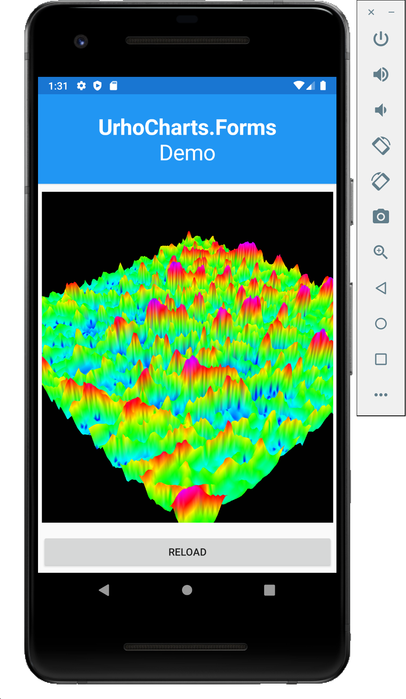
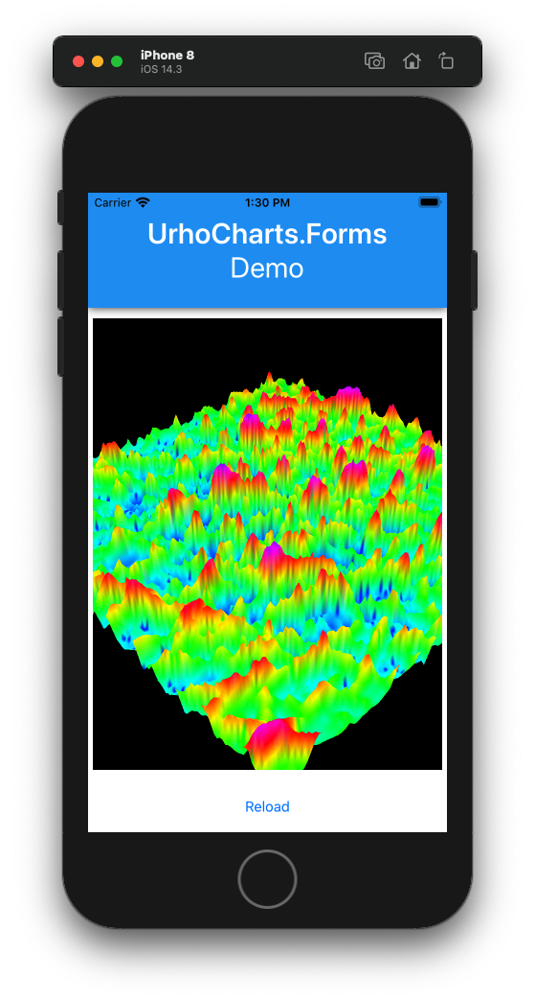

# UrhoCharts.Forms

A simple 3D surface charting library built with [UrhoSharp.Forms](https://github.com/xamarin/urho).

## About

As a hobby developer, I need a 3D surface chart for data visulization in my project. Open-source solution is a reasonable choice. After googling for a while and inspired by [this demo](https://github.com/xamarin/urho-samples/tree/f1bcec78cf8b08c19f5bf29ddfd44181c9e47295/FormsSample), creating this project is finally decided.

## Screenshots

### Android



### iOS



## Installation

Please clone it and build it from source. NuGet package release is comming soon.

## Usage

I pretty like [Microcharts](https://github.com/dotnet-ad/Microcharts) because it is very easy to use, so I try to follow the usage of this project.

### Set up a ChartView in XAML

```xml
<ContentPage
    xmlns="http://xamarin.com/schemas/2014/forms"
    xmlns:x="http://schemas.microsoft.com/winfx/2009/xaml"
    xmlns:ViewModels="clr-namespace:UrhoCharts.Forms.Example.ViewModels"
    xmlns:UrhoCharts="clr-namespace:UrhoCharts.Forms;assembly=UrhoCharts.Forms"
    x:Class="UrhoCharts.Forms.Example.Views.MainPage">

    <ContentPage.BindingContext>
        <ViewModels:MainPageViewModel/>
    </ContentPage.BindingContext>

    <StackLayout>

        <!-- This is what I want to demostrate ;-) -->
        <UrhoCharts:ChartView
            VerticalOptions="FillAndExpand"
            HorizontalOptions="FillAndExpand"
            Margin="5"
            Chart="{Binding SampleChart}">
        </UrhoCharts:ChartView>
    </StackLayout>
</ContentPage>
```

### Prepare the Data

This example displays an image's grayscale of each pixel in the surface chart.

```csharp
var streamImageSource = ImageSource.FromResource("UrhoCharts.Forms.Example.Resources.sample1.jpg") as StreamImageSource;
using (var imageStream = await streamImageSource.Stream(CancellationToken.None))
{
    // BitMiracle.LibJpeg is used to decode this image.
    var jpegImage = new JpegImage(imageStream);
    var imageData = new byte[jpegImage.Width * jpegImage.Height];
    for (var i = 0; i < jpegImage.Height; i++)
    {
        var row = jpegImage.GetRow(i);
        Buffer.BlockCopy(src      : row.ToBytes(),
                         srcOffset: 0,
                         dst      : imageData,
                         dstOffset: (i * jpegImage.Width),
                         count    : jpegImage.Width);
        }

        // This is what I want to demostrate ;-)
        Sample1 = new SurfaceChart
        {
            XSize = jpegImage.Width,
            YSize = jpegImage.Height,
            ZData = imageData,
        };
    }
}
```

You can refer to [this example](https://github.com/hyperpicc/UrhoCharts.Forms.Example).

## Compatibility

It initially targets to [Xamarin.Forms](https://dotnet.microsoft.com/apps/xamarin/xamarin-forms) rather than Xamarin native frameworks.


## Limitations

This repository is still in very early stage. It is very simple and limited.

* Property ``SurfaceChart.ZData`` is a byte array, hence the value range of each data is only 0 to 255.
* No chart title and subtitle
* No legends
* No labels
* No value labels
* No axes


